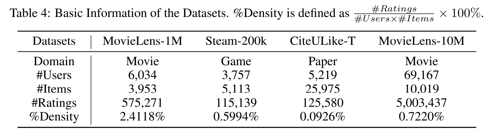

# [The Minority Matters: A Diversity-Promoting Collaborative Metric Learning Algorithm](https://scholar.google.com.hk/citations?view_op=view_citation&hl=zh-CN&user=5ZCgkQkAAAAJ&citation_for_view=5ZCgkQkAAAAJ:UeHWp8X0CEIC)

This is the official code of our paper: 
> Shilong Bao, Qianqian Xu, Zhiyong Yang, Yuan He, Xiaochun Cao, Qingming Huang. [The Minority Matters: A Diversity-Promoting Collaborative Metric Learning Algorithm](https://scholar.google.com.hk/citations?view_op=view_citation&hl=zh-CN&user=5ZCgkQkAAAAJ&citation_for_view=5ZCgkQkAAAAJ:UeHWp8X0CEIC). NeurIPS, 2022. (oral, 1.9%)


# Update

I just started re-organizing our code recently; maybe there are still some bugs that do not be tested. So I am going to follow up and update the code. Please stay tuned!


## Dependencies
All the experiments are carried out on a Ubuntu 18.04.5 server equipped with Intel(R) Xeon(R) Gold 6246R CPU@3.40GHz and RTX 3090 GPUs. In addition, our experiments require

- python 3.8+
- pytorch 1.8+
- numpy
- tqdm
- toolz 
- scikit-learn
- scipy
- pands

## Datasets
In our paper, we evaluate our proposed method on four benchmark datasets, including:
- MovieLens-1M and MovieLens-10M: One of the most popular benchmark datasets with many versions. Specifically, it includes explicit user-item ratings ranging from 1 to 5 and movie types in terms of various movies. We adopt MovieLens-1m and MovieLens-10m here to evaluate the performance. To obtain the implicit preference feedback, if the score of item vj rated by user $u_i$ is no less than 4, we regard item $v_j$ as a positive item for user $u_i$.
- CiteULike: An implicit feedback dataset that includes the preferences of users toward diffferent articles. There are two configurations of CiteULike collected from CiteULike and Google Scholar. We adopt CiteULike-T here to evaluate the performance. 
- Steam-200k: This dataset is collected from the Steam which is the world’s most popular PC gaming hub. The observed behaviors of users include ’purchase’ and ’play’ signals. In order to obtain the implicit feedback, if a user has purchased a game as well as the playing hours play > 0, we treat this game as a positive item



**All the data used in the paper is included in the data file for easy reproduction.**
## How to Run
- First of all, you need to install the dependencies by 
```
pip3 install -r requirements.txt
```

Subsequently, you can config run.sh and run it to obtain all results:

```
chmod +x run.sh
./run.sh
```

More experimental details could be found in the paper.
## Experiments


# Citation & Contact

Please cite our paper if you use this code in your own work.
```
@inproceedings{DPCML, 
author    = {Shilong Bao, Qianqian Xu, Zhiyong Yang, Yuan He, Xiaochun Cao and Qingming Huang},
  title     = {The Minority Matters: A Diversity-Promoting Collaborative Metric Learning Algorithm},
  booktitle = {NeurIPS},
  year      = {2022}
```

Please feel relaxed to contact me at baoshilong@iie.ac.cn if there are any questions. 

